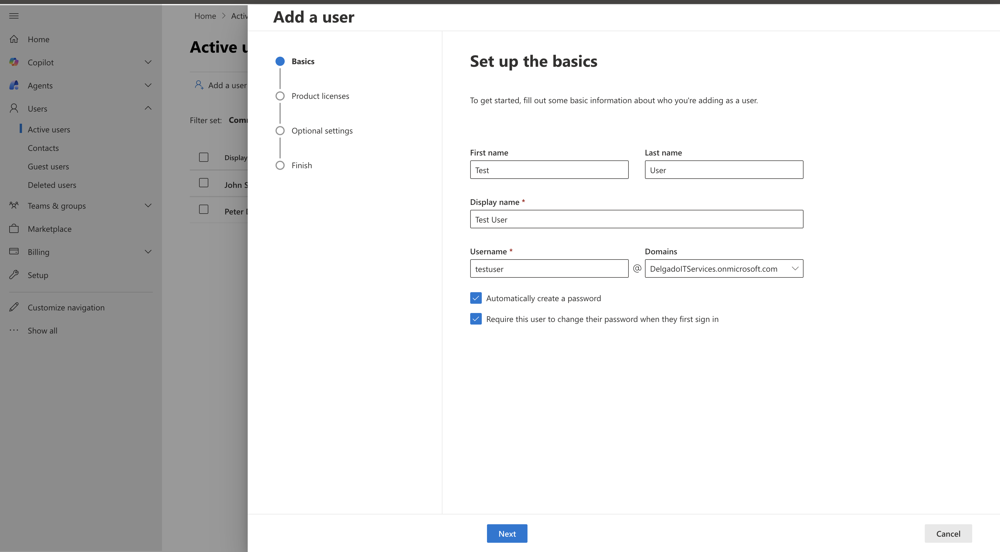
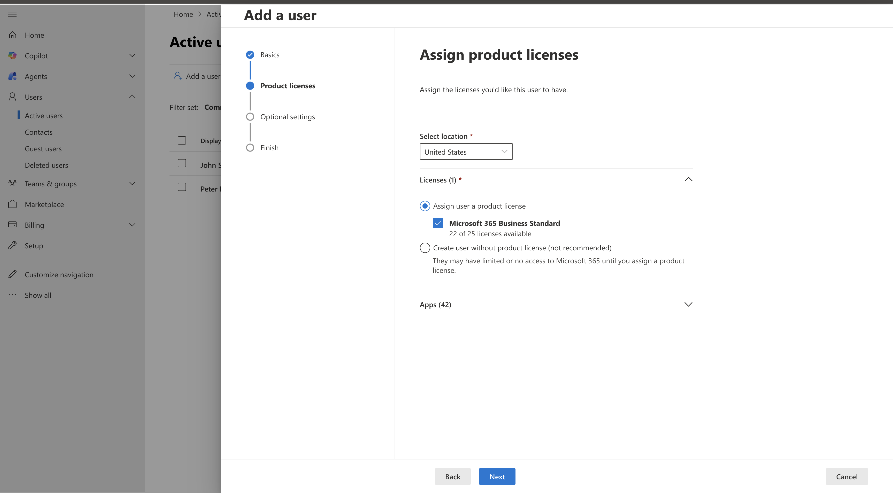
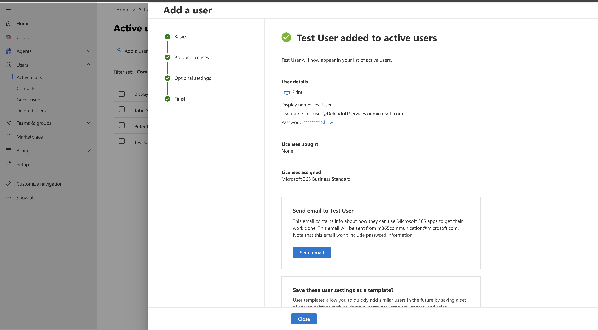
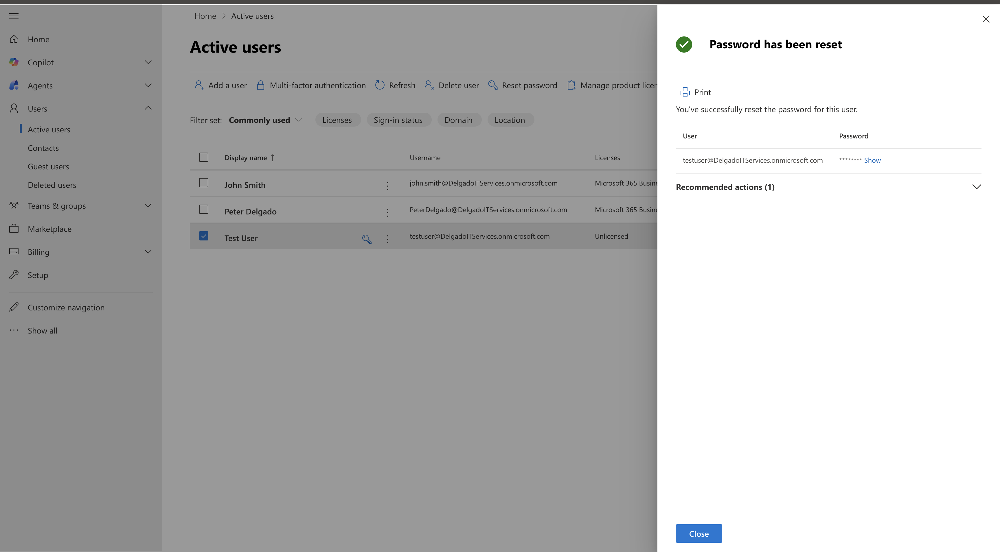
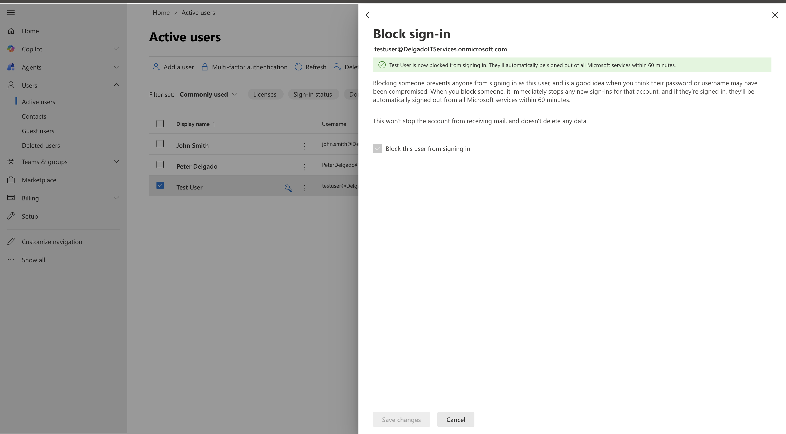
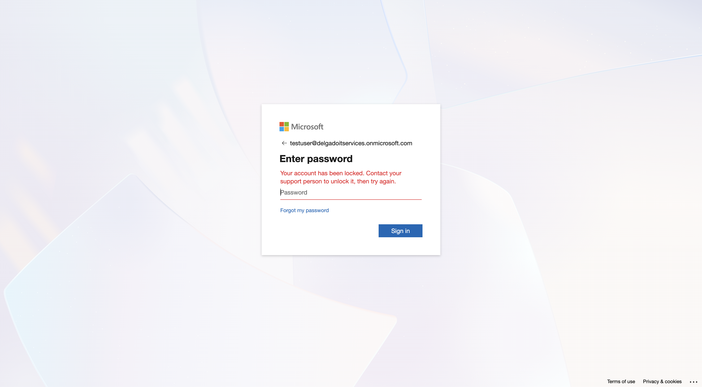
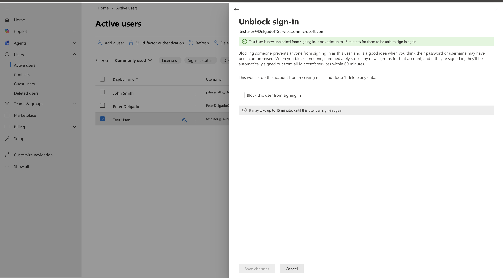
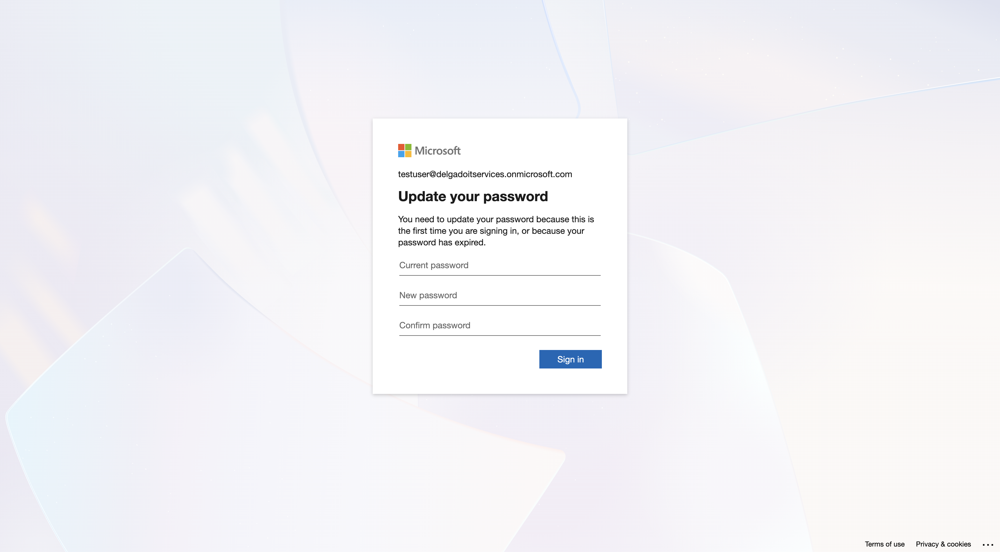

# Microsoft 365 Help Desk Lab

Hands-on Microsoft 365 Admin Center lab demonstrating core Help Desk workflows: user provisioning, licensing, and account access troubleshooting.

---

## What This Lab Covers

- Create a Microsoft 365 user
- Assign a Microsoft 365 Business Standard license
- Verify user creation in the Admin Center
- Block sign-in (simulate compromised account / access restriction)
- Confirm blocked login behavior
- Unblock sign-in (restore access)

---

## Screenshots Walkthrough

### 1) Add Test User (Details Entered)
This shows the user creation flow in the Microsoft 365 Admin Center.

---

### 2) Assign License
Microsoft 365 Business Standard license assignment for the new user.

---

### 3) User Created Successfully (View 1)
Confirmation that the user account was created and is visible in the tenant.

---

### 4) User Password Reset
This shows me resetting a user's password successfully.

---

### 5) Block Sign-in Enabled (Admin Action)
Admin blocks sign-in to prevent user access (security incident simulation).

---

### 6) Account Blocked at Login (User Impact)
User login attempt shows the account is locked/blocked.

---

### 7) Block Sign-in Disabled (Admin Resolution)
Admin restores access by disabling the sign-in block.

---

### 8) Account Unblocked at Login (User Access Restored)
User can proceed after admin re-enables sign-in.

---

## Skills Demonstrated

- Microsoft 365 Admin Center
- User provisioning and identity management
- License assignment
- Account access control (block/unblock sign-in)
- Help Desk troubleshooting workflow
- Documentation and process communication
